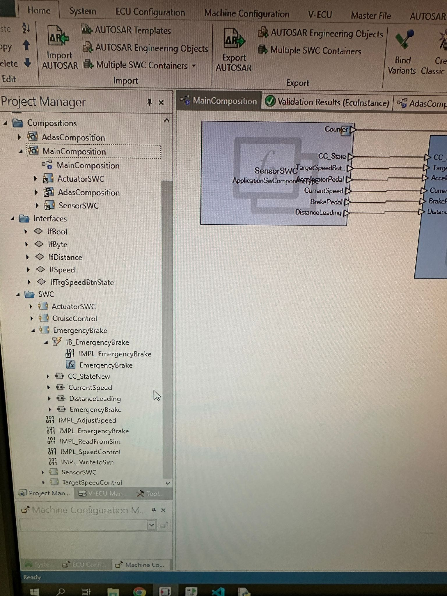
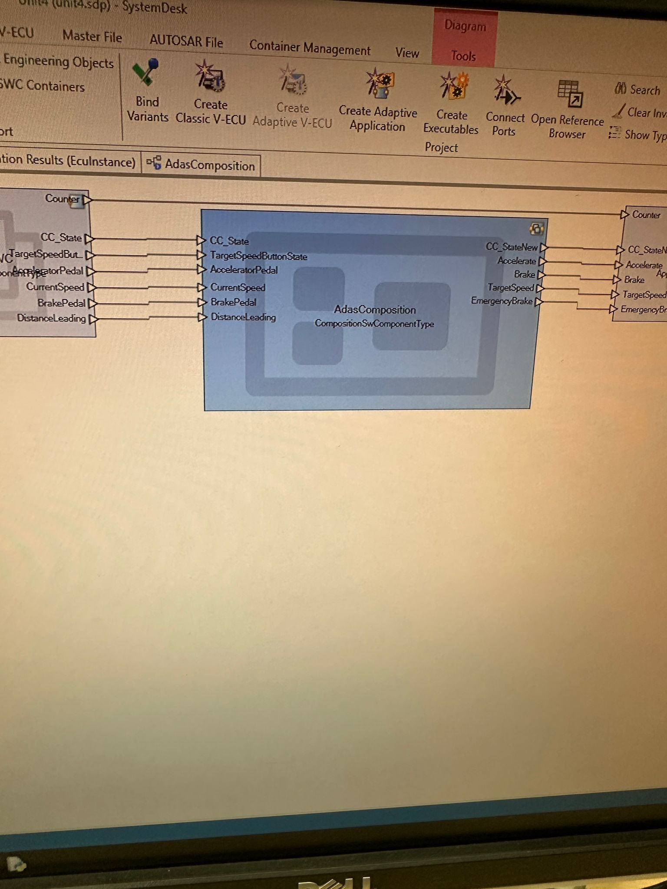
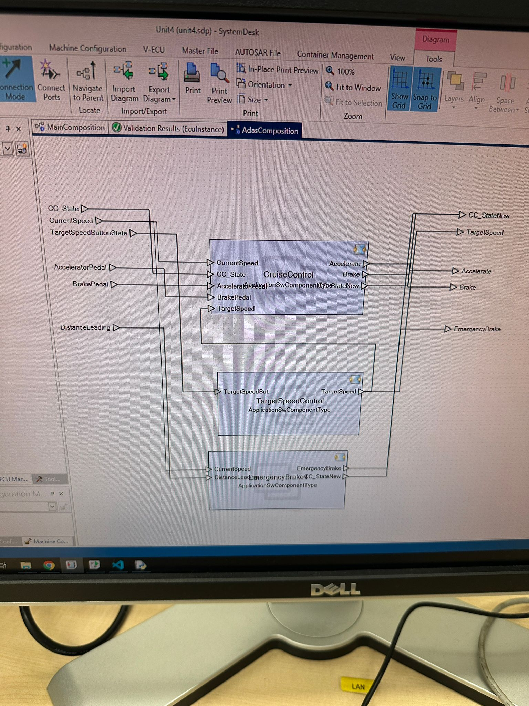
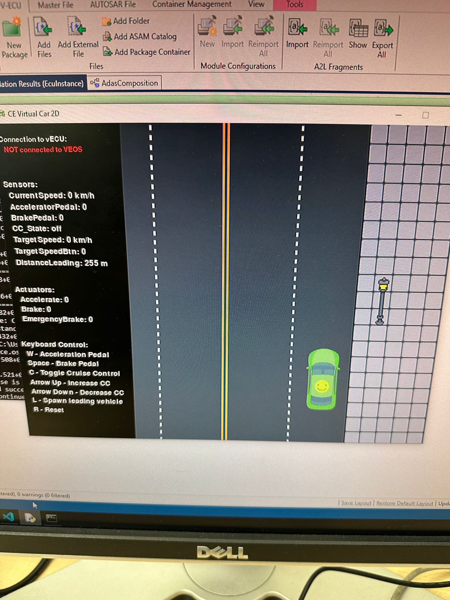

# AUTOSAR ADAS Development: Cruise Control & Emergency Brake  
**University Lab Project | Summer Semester 2025**  
*Technical University of Chemnitz*  

## 📌 Overview  
Implemented **AUTOSAR-compliant ADAS functions** (Cruise Control + Emergency Brake) using **SystemDesk** and tested in a **2D driving simulator (VEOS)**. 
Key features:  
- **Cruise Control**: Dynamic speed regulation (10–130 km/h), manual override, and state management.  
- **Emergency Brake**: Collision avoidance via distance/speed calculations (`d = v²/2a`).  
- **AUTOSAR Workflow**: SWC design, RTE generation, and C-based runnables.  

## 🛠️ Tools & Technologies  
- **AUTOSAR Classic** (SystemDesk)  
- **C Programming** (RTE APIs, event-driven logic)  
- **Simulation**: VEOS, CE Virtual Car 2D  
- **Debugging**: `Sab_SubmitInfo()` for VEOS console logs  

## 🔧 Setup & Execution  
1. **Import** the SystemDesk project (`APackage.arxml`).  
2. **Build V-ECU** in SystemDesk and load into VEOS.  
3. **Launch CE Virtual Car 2D** simulator (connect to VEOS).  
4. **Test**:  
   - **Cruise Control**: Press `C` to enable, `↑/↓` arrows to adjust speed.  
   - **Emergency Brake**: Spawn vehicles with `L` to trigger braking.  

## Screenshots
Here are some visual glimpses of the application's interface and functionality:
### Architecture View

### Main and Adas Composition

### 2d Simulation

## Video Demonstration

Witness the **Cruise Control** and **Emergency Brake** features in action!

You can find a direct video demonstration in the `assets/videos/` folder of this repository:

[▶️ Watch the Demo Video Here](assets/videos/CC-EmergencyBreak.mp4)

*(Note: Some browsers may download the video rather than playing it inline. Ensure you have a suitable media player for `.mp4` files.)*

---

## 🙏 Acknowledgments  
*Dr. Batbayar Battseren* for lab guidance.  
